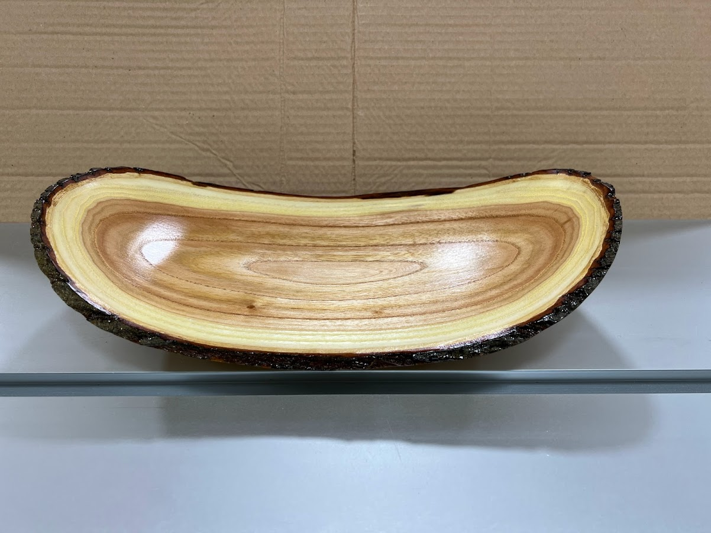
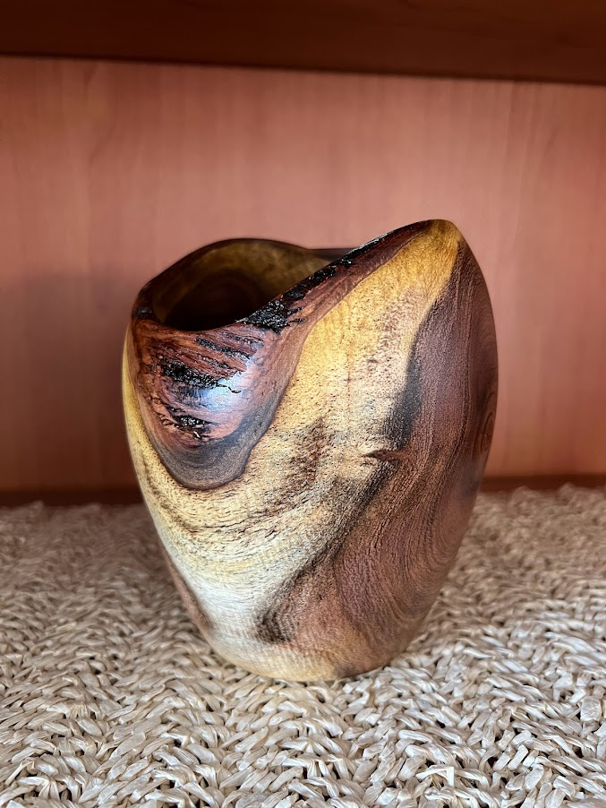
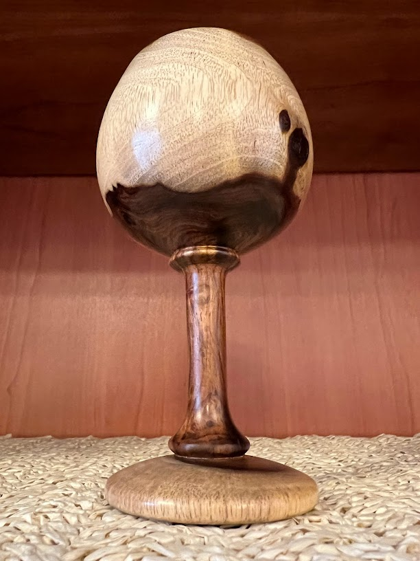
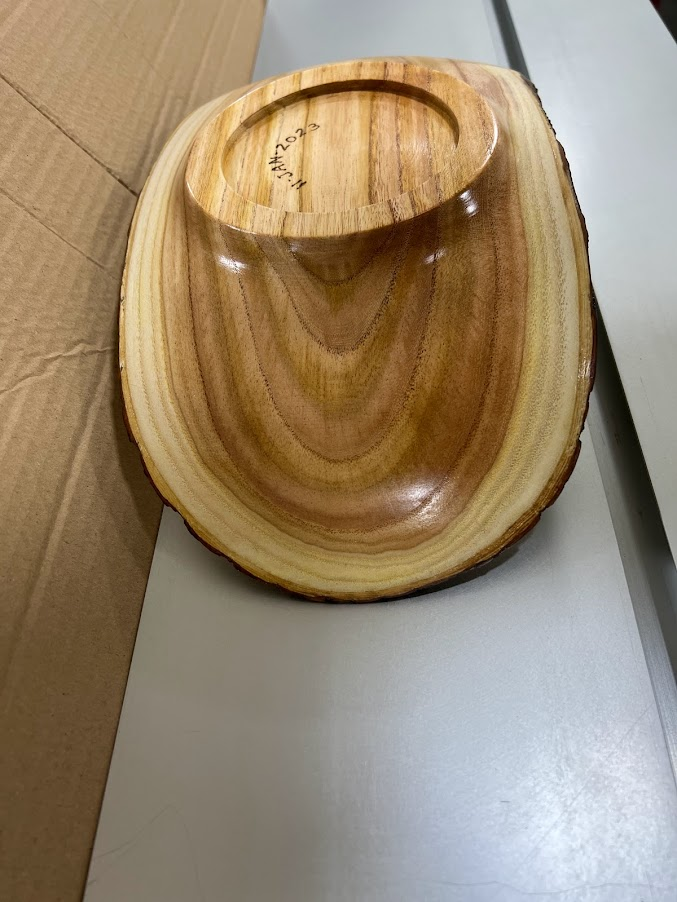
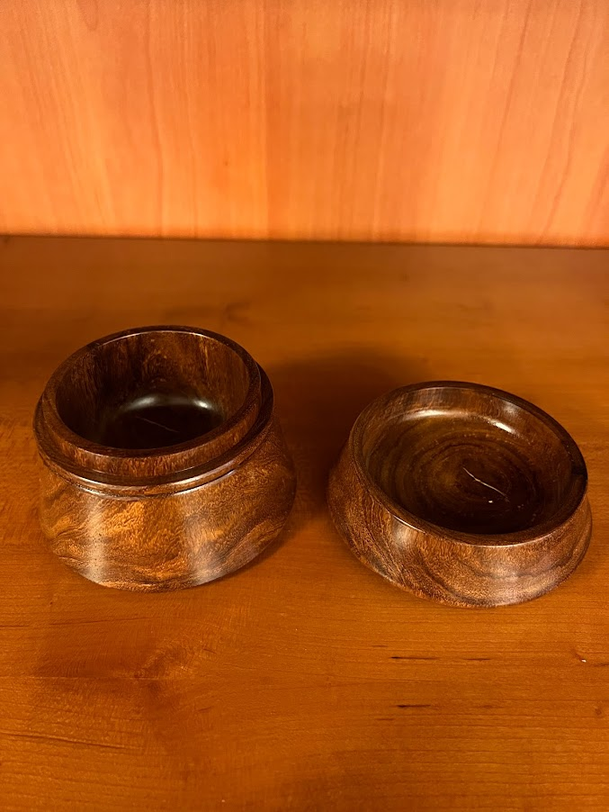
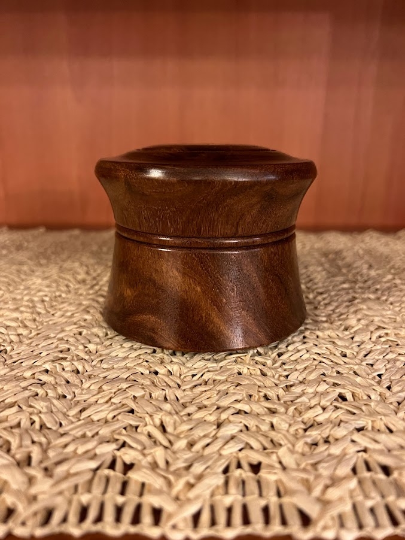

<!--
  Reference: https://github.com/retypeapp/retype/discussions/159
  This is achieved with the custom style in _includes
-->

  <figure>
    
    <figcaption class='caption'>Hello</figcaption>
  </figure>
  <figure>
    
    <figcaption class='caption'>Hello</figcaption>
  </figure>
  <figure>
    
    <figcaption class='caption'>Hello</figcaption>
  </figure>
  <figure>
    
    <figcaption class='caption'>Hello</figcaption>
  </figure>
  <figure>
    
    <figcaption class='caption'>Hello</figcaption>
  </figure>
  <figure>
    
    <figcaption class='caption'>Hello</figcaption>
  </figure>

